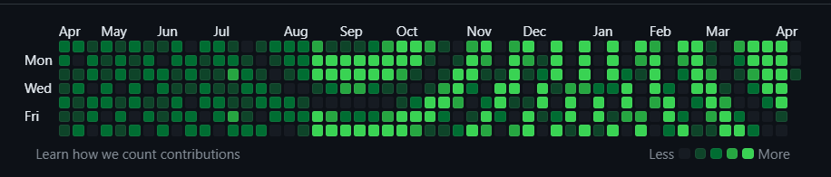

# Image to Github activity graph

This tool reads any image that is exactly 7 pixels tall, and generates a Git
repository with empty commits that will, when uploaded to your Github account,
hopefully make your Github activity graph look that image.

Example:

## Notes

- Depending on your interpretation, this is either a joke, or an art piece.
It's not "serious software". Don't depend on it for anything.

- In theory you can use any image size you want, limited by the png format and
the library I'm using to load the images. This means you can likely generate
images that are 16K pixels wide, which should give you 315 years of commits. I
haven't dared push my luck with that yet. If you decide to try, let me know how
it goes.

- Github doesn't realize if you're stomping over old commits when you `--force`
push new commits. If you want to make Github forget about older commits,
deleting the whole repo works (there might be other, less nuclear options)

